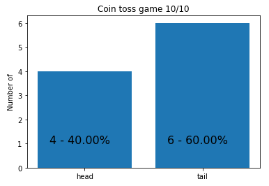

# coin_toss

Simulation of coin toss.

**See in action:**  

This project uses [Pipenv](https://docs.pipenv.org/) for virtual environment.  
  
    $ pipenv install

And [JupyterLab](http://jupyterlab.readthedocs.io/en/stable/) for notebooks.  

    $ pipenv run jupyter lab

**WARNING !!!**  
Code quality can be improved, do not use it for learning the best code quality practice.   
Sometimes there is no cost/benefit in improving code quality of simple scripts.